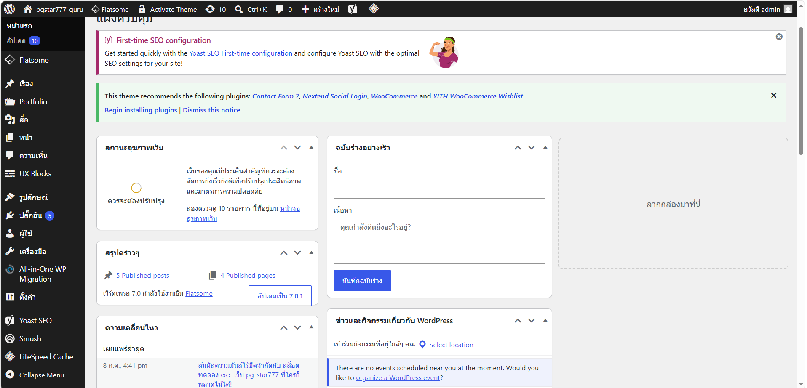
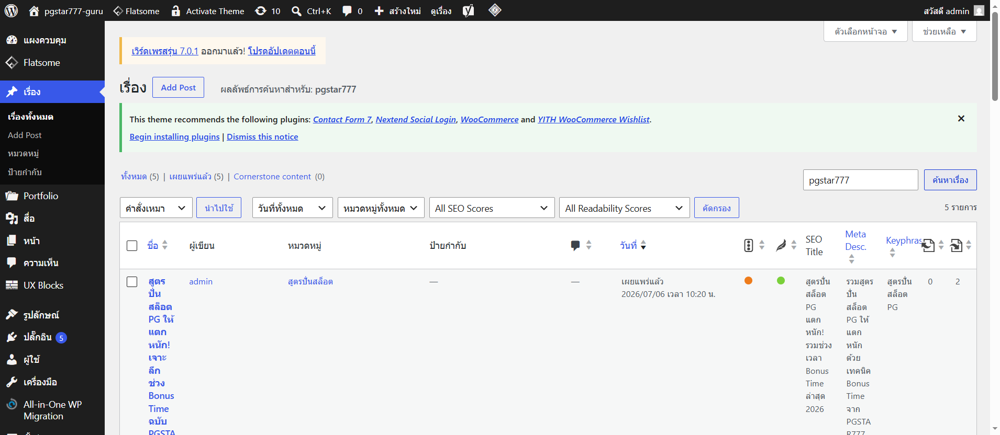
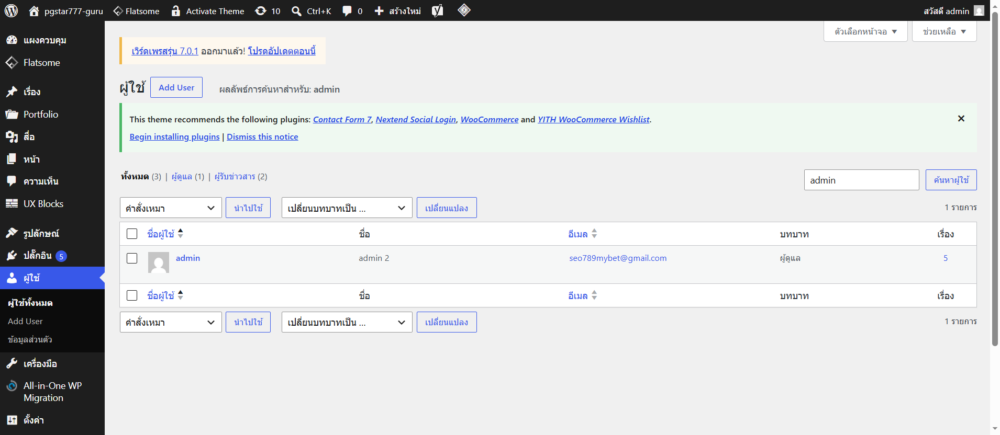
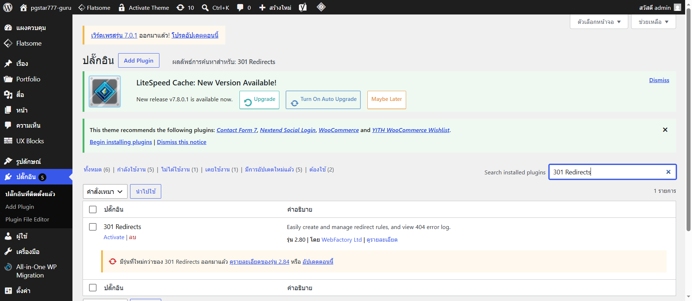
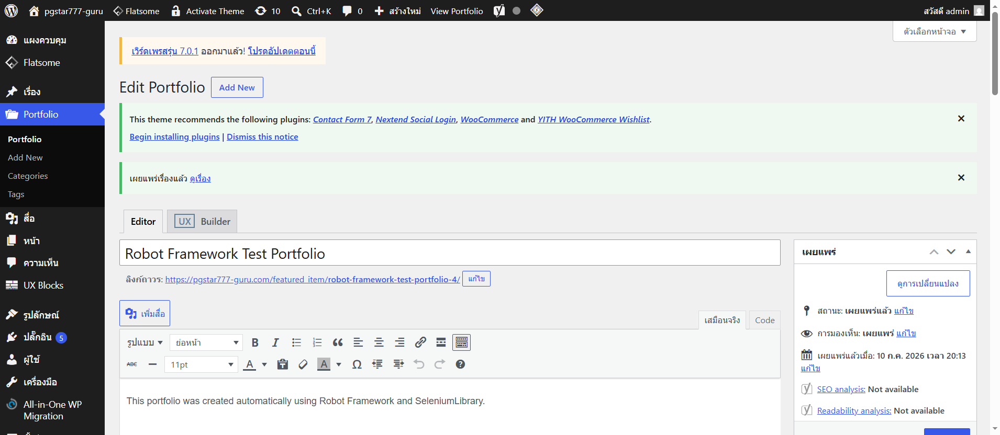
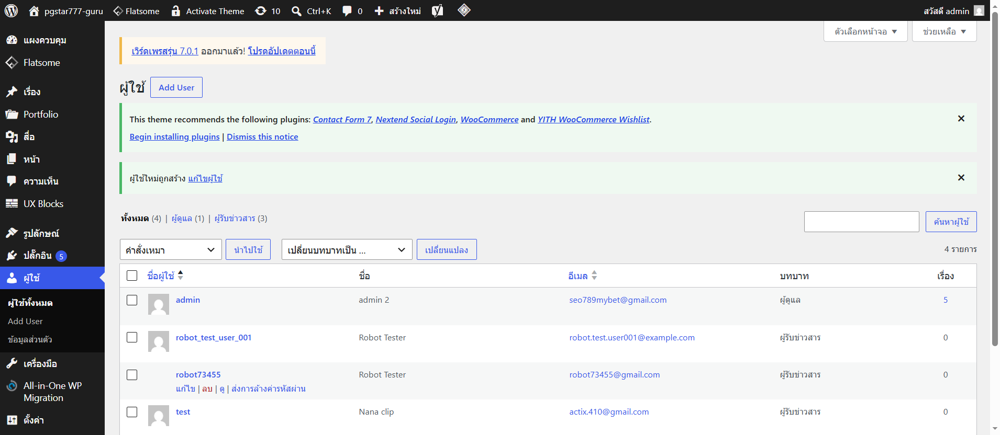
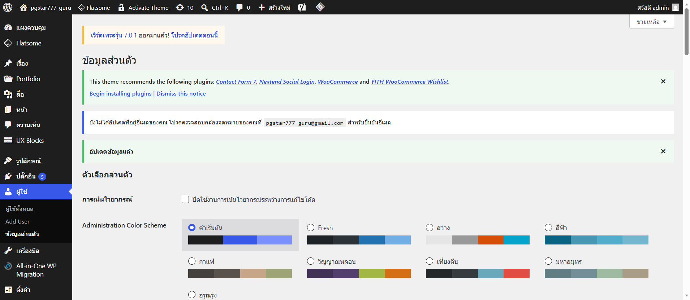
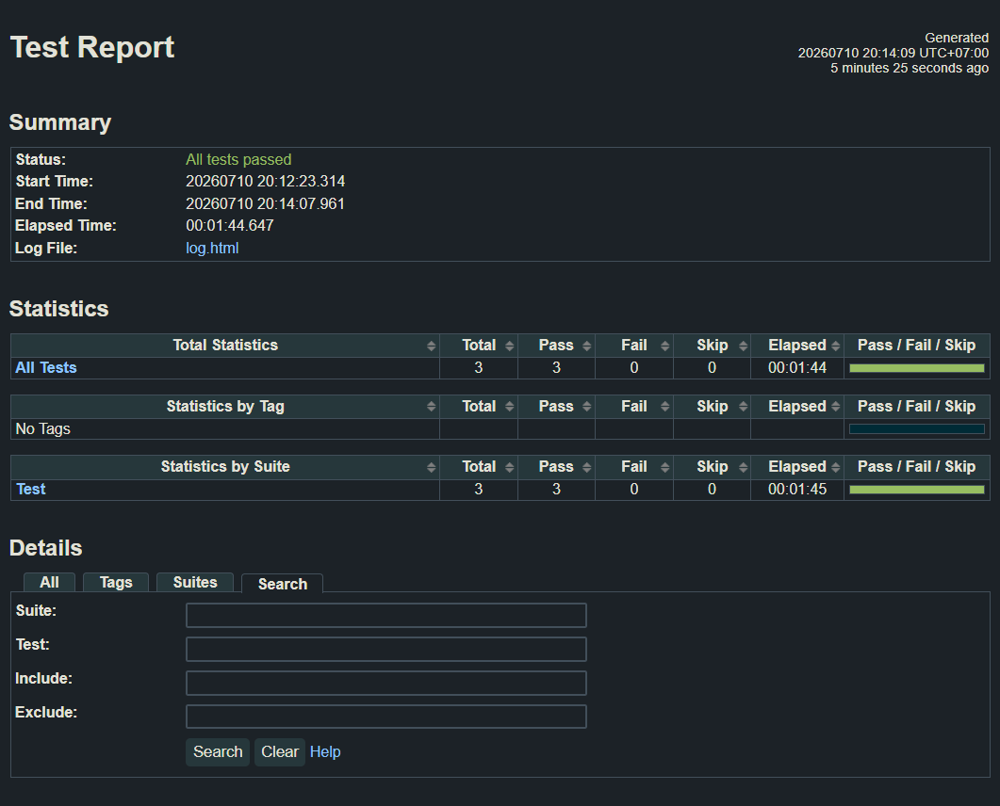
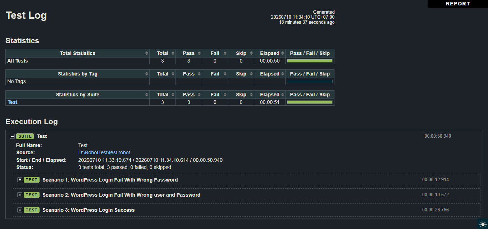
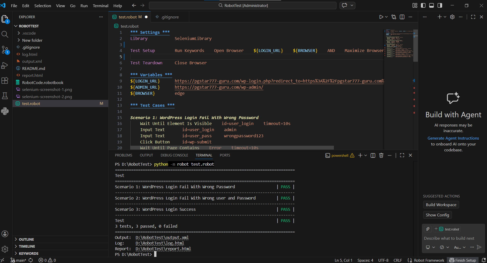

# 🤖 Robot Framework Automation Testing Portfolio

ระบบทดสอบอัตโนมัติ (QA Automation Testing) สำหรับ **WordPress Admin Panel** พัฒนาด้วย **Robot Framework**, **SeleniumLibrary** และ **Microsoft Edge**

This project demonstrates end-to-end automation testing for the WordPress Admin Panel using Robot Framework and SeleniumLibrary.

---

# 📖 รายละเอียดโครงการ (Project Overview)

โปรเจกต์นี้จัดทำขึ้นเพื่อแสดงทักษะด้าน **QA Automation Testing** โดยจำลองการทดสอบการใช้งานระบบ WordPress Admin แบบอัตโนมัติ ตั้งแต่การเข้าสู่ระบบ การค้นหาข้อมูล การเพิ่มข้อมูล และการแก้ไขข้อมูล

* QA Engineer
* Software Tester
* QA Automation Engineer
* Software Quality Assurance

---

# 🛠️ เทคโนโลยีที่ใช้ (Technologies)

* Robot Framework
* SeleniumLibrary
* Python
* Microsoft Edge
* Edge WebDriver

---

# ✅ ฟังก์ชันที่ทดสอบ (Automated Test Scenarios)

## 🔐 Login Testing

* Login สำเร็จ
* Login รหัสผ่านไม่ถูกต้อง
* Login Username และ Password ไม่ถูกต้อง

---

## 📂 Menu Navigation

ทดสอบการเข้าใช้งานเมนู

* Dashboard
* Flatsome
* เรื่อง (Posts)
* Portfolio
* สื่อ (Media)

---

## 🔍 Search Testing

ทดสอบการค้นหาข้อมูล

* ค้นหา Posts
* ค้นหา Users
* ค้นหา Plugins

---

## 📝 Form Testing

ทดสอบการกรอกข้อมูลในระบบ

* สร้าง Portfolio ใหม่
* เพิ่มผู้ใช้งานใหม่
* แก้ไขข้อมูล Profile

---

# 📁 โครงสร้างโปรเจกต์ (Project Structure)

```text
robot-framework-automation-testing
│
├── screenshots
│   ├── dashboard.png
│   ├── search-post.png
│   ├── search-user.png
│   ├── search-plugin.png
│   ├── portfolio-created.png
│   ├── add-user-form.png
│   ├── user-created.png
│   ├── profile-before-update.png
│   ├── profile-updated.png
│   ├── robot-log.png
│   ├── robot-report.png
│   └── test-summary.png
│
├── test.robot
├── requirements.txt
├── .gitignore
└── README.md
```

---

# ▶️ วิธีใช้งาน (How to Run)

ติดตั้ง Library

```bash
pip install -r requirements.txt
```

รันการทดสอบ

```bash
robot test.robot
```

---

# 📸 ตัวอย่างผลการทดสอบ (Screenshots)

## Dashboard



---

## Search Post



---

## Search User



---

## Search Plugin



---

## Create Portfolio



---

## Add New User



---

## Update Profile



---

## Robot Framework Report



---

## Robot Framework Log



---

## Test Summary



---

# 💼 ทักษะที่แสดงในโปรเจกต์นี้ (Skills Demonstrated)

* QA Automation Testing
* Functional Testing
* UI Testing
* End-to-End Testing
* Robot Framework
* SeleniumLibrary
* Selenium WebDriver
* Test Case Automation
* Form Validation
* Search Testing
* Screenshot Capture
* Test Reporting

---

# 👨‍💻 ผู้พัฒนา (Author)

**Witthawat Boonpanya**

QA Automation Testing Portfolio
